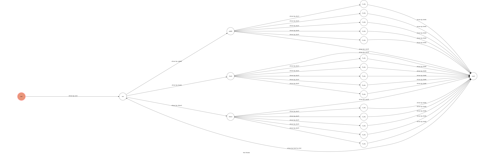

# TOC Project 2017

A telegram bot based on a finite state machine

## Detail about how to interact with your chatbot
### 流程
	開始執行後，選取想要的歌曲語言，再選取想要的歌曲或取消此次選取重新來過
	若選取了歌曲，Bot就會傳送您所選取的歌曲給您。
### 用法
執行程式後，連接到 **`@amyabot`**。
輸入 **`/start`** 開始進行對談。


可以選取中文、英文、法文三種語言，選取語言後bot會回傳歌單，每個語言有五首歌曲可以選擇，使用者可以選擇要那一首歌或取消此次選取。


若選取歌曲bot就會回傳該首歌曲


並出現 **`Finish`** 選項，


點選Finish選項後，會再次確認是否要進行新的選取(若中間有選取 **`Cancel`** 選項也是跑到此狀態)


點選 **`Yes`** 後，就會回到選取語言的狀態，就會跑到確認是否進行新的選取的狀態，點選Yes後回到選取語言的狀態。


## Detail about how to run you code
```sh
./ngrok http 5000
```
```sh
python3 app.py
```
* bot's name : @amyabot


## Finite State Machine


